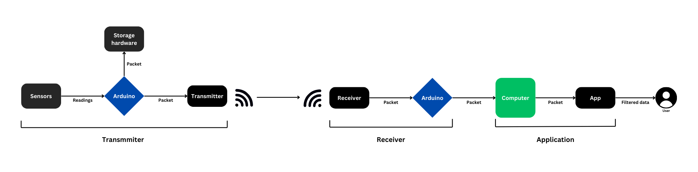

# Generic telemetry system

This document should help you understand the motivations that led to the development of this software and the technical decisions involved.

## Context

We need a telemetry system that is capable of acquiring data from multiple sensors on a moving vehicle and transmitting or storing it in a way that it can be analyzed. The system must be efficient and as inexpensive as possible.

## Decision Drivers

* Data acquisition frequency
* Cost-Effectiveness 
* Ease to modify
* Real-time perfomance

## Decision Outcome

Taking into consideration the decision drivers outlined earlier, the following architecture was chosen, aiming to reduce the computational effort endured by the embedded system and transfer it to the computer.

#### Arduino as Transmitter:

- **Cost-effectiveness:** Arduinos are relatively inexpensive and widely available, making them a budget-friendly option for data acquisition.
- **Ease of use:** Arduinos are easy to program and interface with various sensors, simplifying the development process.
- **Flexibility:** Arduinos offer a wide range of libraries and shields, providing flexibility in integrating different sensor types.

#### Arduino as Receiver:

- **Simple and reliable communication:** Arduinos can easily be configured to send and receive data via various modules using a variety of protocols.
- **Low power consumption:**  Arduinos are generally low-power devices, and can be powered via the same USB connection that we are going to use to transmit data.

#### Data Processing on Computer:

- **Computational power:** Computers offer significantly more processing power than microcontrollers like Arduinos, enabling more complex data analysis, real-time visualization, and computationally demanding tasks.
- **Software flexibility:** A wide range of software tools and programming languages are available for data analysis, visualization, and storage, offering the possibility to develop a flexible and cross-platform solution.
